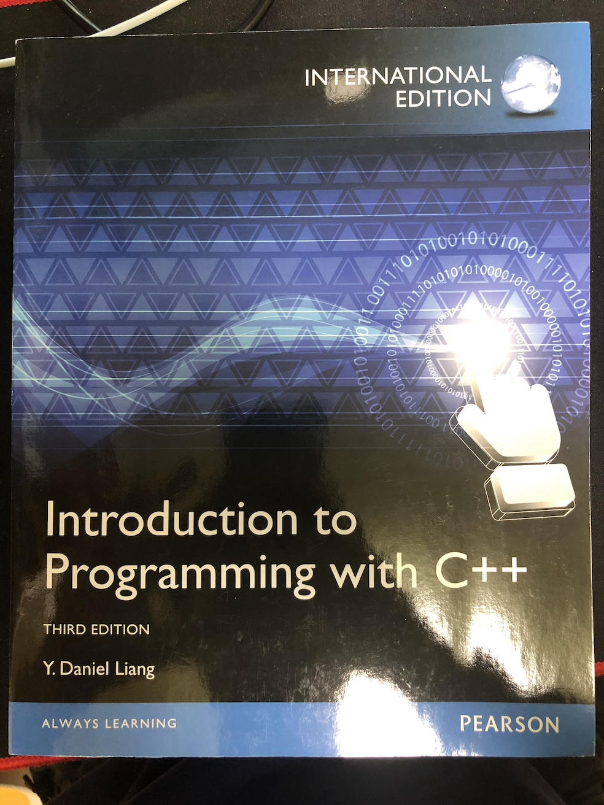

# C++

## 수업 정보

* 교수님: 윤영미 교수님.
* 교재: Introduction to Programming with C++

* 학기: 2학년 1학기, 2021년도 1학기 수강.

## 수업일별 내용

### 3월 8일

#### 수업 전

* 꿈을 크게 가져라.
* 잘 하는 언어 하나는 만들어라.
* 영어 읽기는 잘 해라.
* 한국에서 석사하지 말고 미국에서 해라.
* 아마존 초봉이 22만불이더라.

#### 수업중.

* <<을 영어로 뭐라 하는지.
    * opening angled brackets
    * stream insertion operator
* cout : console output
    * standard C++ output stream object
* C++ include path : `/Applications/Xcode.app/Contents/Developer/Toolchains/XcodeDefault.xctoolchain/usr/include/c++/v1`
* Logic Error
    * = Semantic Error
* Syntax Error
* Runtime Error

#### Reading Assignment

* 2.3
* 2.7
* 2.8.1

#### 수업 끝나고

* 앞자리 조교 끝.
* 교재는 가져라.
* 미국가서 석사해라.
* 출석 면제니까 개발 열심히 하고 시험 잘 봐라.

